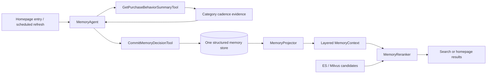

# Memory Agent for Search Recommendation

The memory package is one domain service with two consumers:

Public request and response examples are documented in [AGENT_IO.md](./AGENT_IO.md).

## Package structure

```text
agents/memory/                 # one Memory Agent
├── tools/                     # deterministic capabilities owned by this Agent
│   ├── purchase_behavior.py   # read and summarize category purchase cadence
│   └── memory_commit.py       # validate and audit memory mutations
├── agent.py                   # decide when and how tools are called
├── policy.py                  # convert behavior evidence to typed operations
├── projector.py               # build bounded scene-specific ranking context
├── reranker.py                # consume context; never read the memory store
└── store.py                   # persistence implementation
```

The Agent is intentionally thin. New purchase-cadence capabilities live in
`tools/`; behavior, cadence, and explicit-forget mutations pass through
`CommitMemoryDecisionTool`. The older expression/reflection components remain
compatible and can be migrated to the same boundary later.



- `HomepageRecommendationAgent` uses shopping intent, qualified preferences,
  negative feedback, and purchase suppression.
- `SearchRecommendationAgent` keeps current query constraints at the highest
  authority, uses relevant product memory only as a soft reranking signal, and
  uses the expression profile only to choose a clarification policy.

## Write policy

| Evidence | Persistent effect | Injection rule |
| --- | --- | --- |
| One view | Low-confidence recent evidence | Not projected until confidence reaches the threshold |
| Repeated views | Strengthens the same recent assertion | Eligible after sufficient evidence |
| Favorite | Long-term product preference | Eligible immediately |
| Add to cart | Daily shopping intent | Strong homepage/search signal |
| Purchase | Durable purchase record | Closes matching shopping intent |
| Search query | Updates expression profile only | Explicit constraints remain request-local L0 |
| Repeated purchases | Category-level cadence state | `due` is a soft boost; `lapsed` is weaker; `active` and `dormant` are not injected |

LLM output is not a write authority. A future extractor may propose typed
evidence, but `MemoryWritePolicy`, `CommitMemoryDecisionTool`, and the Pydantic
contracts remain the gates.

## Purchase cadence evolution

`refresh_purchase_cadence` learns only from categories with at least three
purchases. It does not label the whole user as a “frequent buyer” or “churned
user”. The expected interval is the median of observed purchase intervals, and
the current category state evolves through `active`, `due`, `lapsed`, and
`dormant`.

This distinction matters for ranking: a due repeat purchase is useful evidence,
a lapsed pattern is only a weak reactivation signal, and very old dormant
behavior must not keep pushing products forever. Search additionally requires
the cadence category to be relevant to the current query; homepage projection
may use all actionable cadence categories.

## Expression evolution

`ExpressionProfileLearner` maintains bounded sufficient statistics instead of
storing every query summary:

- dimension disclosure counts for category, brand, budget, and use case;
- clarification offered/accepted counts;
- query reformulation count;
- sample-based profile confidence.

The resulting policy is reversible and non-blocking:

- complete query: proceed;
- cold start: offer filters;
- user usually accepts clarification: ask one high-value constraint;
- user usually rejects clarification: proceed with soft memory supplementation;
- normally explicit user omits a dimension: treat it as unconstrained.

## Runtime wiring

Infrastructure is injected so importing this package never connects to
Elasticsearch or Milvus:

```python
search_agent = SearchRecommendationAgent(
    lambda query, top_k: hybrid_search(query, final_top_k=top_k),
    memory_agent,
)
```

The homepage candidate source is intentionally another injected function because
the repository does not yet implement homepage recall.

## Evaluation

Run memory behavior as independent A/B treatments:

1. retrieval only;
2. product-memory reranking;
3. product-memory reranking plus expression-aware clarification.

Track CTR, add-to-cart rate, conversion, search reformulation, clarification
acceptance, abandonment, and the number of rankings changed by memory.
